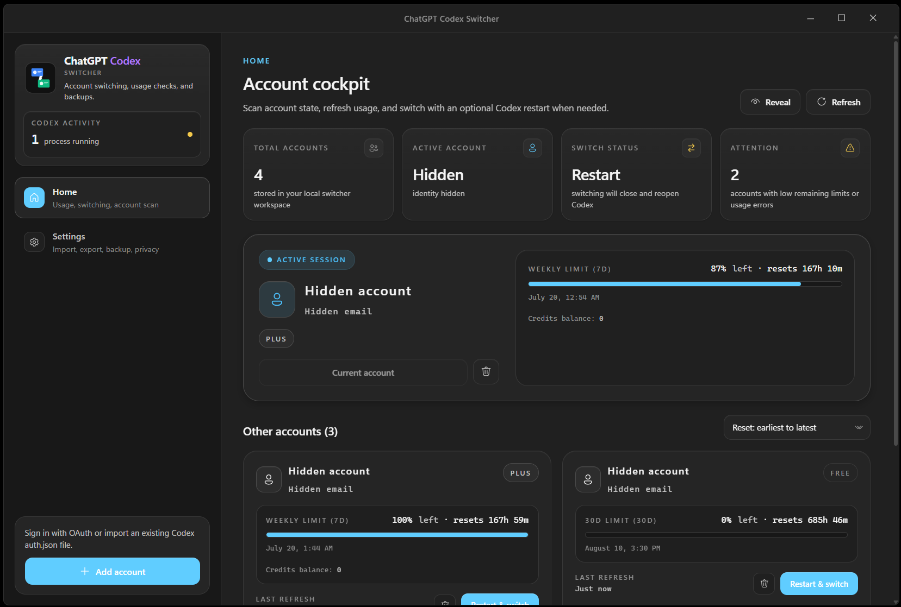

<div align="center">
  

  <h1>ChatGPT Codex Switcher</h1>

  <p><strong>A desktop-first account cockpit for Codex.</strong></p>

  <p>
    Switch personal OpenAI accounts safely, inspect live plan and usage data, protect identities,<br>
    and keep recovery-ready backups from one focused native app.
  </p>

  <p>
    
    
    
    
  </p>
  <p>
    
    
    
  </p>

  <p>
    <a href="#interface-preview">Interface</a> ·
    <a href="#feature-set">Features</a> ·
    <a href="#architecture">Architecture</a> ·
    <a href="#quick-start">Quick Start</a> ·
    <a href="#browser-mode">Browser Mode</a> ·
    <a href="#backups">Backups</a> ·
    <a href="#development">Development</a> ·
    <a href="#safety-notes">Safety</a>
  </p>
</div>

> [!NOTE]
> Forked from [Lampese/codex-switcher](https://github.com/Lampese/codex-switcher), this project has left the fork network and now continues independently. Browser mode binds to `127.0.0.1` by default; LAN access requires HTTP Basic authentication.

## Interface Preview



## Why ChatGPT Codex Switcher

ChatGPT Codex Switcher is built for people who legitimately own multiple Codex-compatible accounts and want a safer way to move between them without manually editing `auth.json`.

It gives you:

- One place to manage Codex accounts
- Fast account switching with process-safety checks
- Usage visibility for account limits
- Restart-and-switch support when Codex is already running
- Slim text import/export and encrypted full backups
- Optional local browser dashboard for LAN or remote-host workflows

## Feature Set

### Account Switching

Switch the active Codex account from a desktop UI. The app updates the local Codex auth file and refreshes last-used metadata.

### Restart Switching

When enabled, ChatGPT Codex Switcher can close running Codex windows, switch accounts, and reopen the captured Codex process command.

### Usage Checks

Refresh account usage, warm up accounts, and see 5-hour and weekly limit state from the dashboard.

### Imports and Backups

Import existing `auth.json` files, export compact slim text payloads, or create encrypted full `.cswf` backups.

### Privacy Controls

Mask account names, emails, and initials across the UI when sharing your screen.

### Browser Mode

Serve the same dashboard over HTTP for local browser testing, LAN access, Tailscale, or remote-host workflows.

## Control Surfaces

| Surface | Best For | Notes |
| --- | --- | --- |
| Desktop app | Daily use | Tauri shell with native dialogs and updater support |
| Browser dashboard | Local/LAN testing | Runs through the `codex-web` server |
| Slim transfer | Quick migration | Compact text import/export for account definitions |
| Full backup | Local recovery | Encrypted `.cswf` backup bound to the current machine/profile |

## Architecture

The desktop app and browser dashboard share the same Rust command layer, so account switching and backup behavior stay consistent across both surfaces.


## Quick Start

### 1. Install prerequisites

- Node.js 18+
- pnpm through Corepack
- Rust through rustup

### 2. Install dependencies

```bash
corepack pnpm install
```

### 3. Run the desktop app in development

```bash
corepack pnpm tauri dev
```

### 4. Build the desktop app

```bash
corepack pnpm build:app
```

Build outputs:

- Frontend files: `build/web/`
- Desktop executable: `build/tauri-target/release/codex-switcher.exe`
- Installers: `build/tauri-target/release/bundle/`

For signed updater artifacts:

```bash
corepack pnpm build:app:signed
```

## Browser Mode

Build the frontend and start the local web server:

```bash
corepack pnpm lan
```

Open:

```text
http://127.0.0.1:3210
```

### LAN Access

PowerShell:

```powershell
$env:CODEX_SWITCHER_WEB_HOST="0.0.0.0"
$env:CODEX_SWITCHER_WEB_PASSWORD="change-me"
corepack pnpm lan
```

Bash:

```bash
CODEX_SWITCHER_WEB_HOST=0.0.0.0 CODEX_SWITCHER_WEB_PASSWORD=change-me corepack pnpm lan
```

Open from another device:

```text
http://YOUR_PC_IP:3210
```

HTTP Basic auth username:

```text
codex
```

## Configuration

| Variable | Required | Description |
| --- | --- | --- |
| `CODEX_HOME` | No | Overrides the Codex config directory used for `auth.json` |
| `CODEX_SWITCHER_CONFIG_DIR` | No | Overrides the ChatGPT Codex Switcher account store directory |
| `CODEX_SWITCHER_WEB_HOST` | No | Browser server bind host, defaults to `127.0.0.1` |
| `CODEX_SWITCHER_WEB_PORT` | No | Browser server port, defaults to `3210` |
| `CODEX_SWITCHER_WEB_PASSWORD` | Required for non-loopback | Enables HTTP Basic auth for browser mode |
| `CODEX_SWITCHER_WEB_TOKEN` | No | Legacy alias for `CODEX_SWITCHER_WEB_PASSWORD` |

## Backups

ChatGPT Codex Switcher supports two backup paths.

| Format | Best For | Security Model |
| --- | --- | --- |
| Slim text | Quick transfer | Compact payload containing account secrets |
| Full `.cswf` | Local recovery | Encrypted with a machine-bound key stored in the OS keychain |

New full backups are machine-bound. A `.cswf` file exported on one machine/profile can only be restored from the same machine/profile.

Legacy `.cswf` backups using the older built-in passphrase format remain importable, but new exports use the machine-bound format.

## Process Safety

ChatGPT Codex Switcher checks for running Codex app instances before switching accounts.

Current behavior:

- Normal switching is blocked while live Codex windows are running.
- Restart switching can close Codex, switch accounts, and reopen captured Codex processes.
- Matching Antigravity/OpenAI extension app-server processes are restarted after account activation so they pick up the new auth file.
- Background or stale Codex helper processes are ignored when they are not active app windows.

## Development

Useful commands:

```bash
corepack pnpm typecheck
corepack pnpm test
corepack pnpm format:check
cargo fmt --check --manifest-path src-tauri/Cargo.toml
cargo test --manifest-path src-tauri/Cargo.toml
cargo clippy --manifest-path src-tauri/Cargo.toml --all-targets -- -D warnings
```

Project layout:

```text
.
|-- src/              React app
|-- src-tauri/        Rust backend and Tauri shell
|-- scripts/          Build, LAN, and release helpers
|-- public/           Static frontend assets
`-- build/            Generated build output
```

## Versioning

Keep package, Tauri, Cargo, and lockfile versions in sync:

```bash
corepack pnpm version:patch
corepack pnpm version:minor
corepack pnpm version:major
```

Prepare a release commit and tag:

```bash
corepack pnpm release patch
```

Prepare and push:

```bash
corepack pnpm release patch -- --push
```

## Safety Notes

ChatGPT Codex Switcher is intended for accounts you personally own.

It is not intended for:

- Sharing accounts between multiple users
- Account pooling
- Circumventing OpenAI terms or usage policies

Slim exports contain account secrets. Treat them like credentials.

## Summary

ChatGPT Codex Switcher is a focused desktop utility for managing multiple personal Codex accounts with safer switching, clear usage visibility, encrypted local backups, and an optional browser dashboard for controlled local or LAN access.
